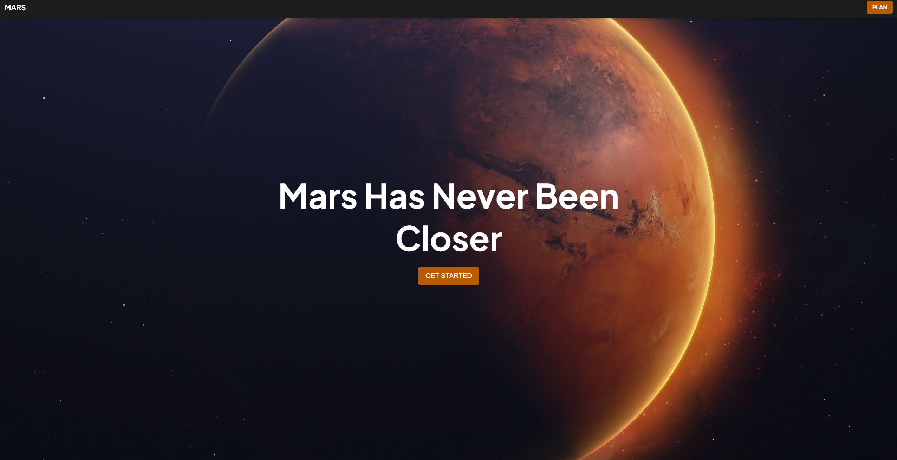
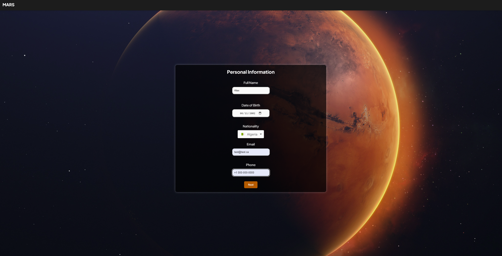
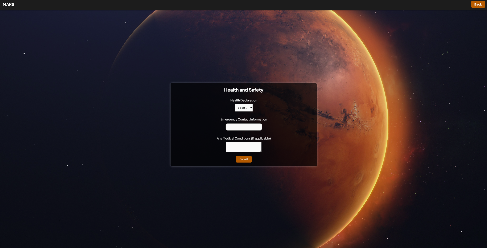

### Mars

A simple multi-stage application form for individuals interested in visiting Mars.

You can run the app using:

### `npm start`

Runs the app in the development mode.\
Open [http://localhost:3000](http://localhost:3000) to view it in your browser.

## Screenshots

### Landing Page

### Stage One

### Stage Two

### Stage Three

